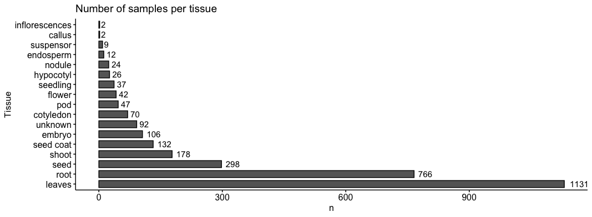

```{r setup, include=FALSE}
knitr::opts_chunk$set(
  echo = FALSE, warning = FALSE, message = FALSE,
  out.width='50%',
  fig.align='center', 
  dpi = 300
)
options(htmltools.dir.version = TRUE)
```

```{r xaringan-fit-screen, echo=FALSE}
xaringanExtra::use_fit_screen()
```

```{r xaringan-tile-view, echo=FALSE}
xaringanExtra::use_tile_view()
```

```{r xaringan-scribble, echo=FALSE}
xaringanExtra::use_scribble()
```

```{r xaringan-panelset, echo=FALSE}
xaringanExtra::use_panelset()
```

class: center, inverse, middle

# Network-based gene discovery

---

background-image: url(https://github.com/almeidasilvaf/bioc2021/blob/master/figs/cageminer_logo.png?raw=true)
background-position: 93% 60%
background-size: 30%

## {cageminer}: mining candidate genes by integrating GWAS and coexpression networks

.pull-left-2[
- Acronym for **candidate gene miner**

.brand-charcoal[.font130[**Rationale**]]

- **Guilt-by-association:** genes controlling the same phenotype tend to be coexpressed.

.brand-charcoal[.font130[**Why cageminer?**]]

- **Originality:** first and only R package to solve the long-standing SNP-to-gene mapping problem.

- Takes advantage of prior knowledge to find high-confidence candidates.

- Combines independent sources of evidence.

]

---

## The algorithm

```{r out.width='95%'}
knitr::include_graphics("https://github.com/almeidasilvaf/bioc2021/blob/master/figs/Fig1.png?raw=true")
```

---

class: center, inverse, middle

# The Soybean Expression Atlas: current status

---

## The Soybean Expression Atlas now

<br />
**2978 samples** (129% increase)

New samples for previously underrepresented tissues (e.g., nodule).

```{r out.width='100%'}

```

```{r, eval=FALSE, include=FALSE}
library(dplyr)
library(tidyverse)
library(ggpubr)
coldata %>%
  as.data.frame() %>%
  count(Tissue) %>%
  mutate(Tissue = fct_reorder(Tissue, -n)) %>%
  filter(!Tissue %in% c("root_leaves", "leaves_root", "root_shoot")) %>%
  ggbarplot(., x="Tissue", y="n", fill="grey40", label = TRUE, 
            orientation="horiz", lab.pos="out", 
            lab.vjust = 0.5, lab.hjust = -0.3, ylim=c(0,1500)) +
  labs(title="Number of samples per tissue")
```

---

## The data tsunami

<br />
```{r fig.width=10, fig.height=5, out.width='85%'}
suppressPackageStartupMessages(library(tidyverse))
metadata <- readr::read_csv("~/Downloads/SraRunTable.txt")
metadata %>%
  mutate(year = lubridate::year(ReleaseDate)) %>%
  count(year) %>%
  ggplot(., aes(x=year, y=n)) +
  geom_col() +
  theme_bw() +
  labs(
    title = "Number of BioSamples for each year",
    x = "Year", y = "# of samples"
  ) +
  scale_x_discrete(limits = 2010:2022)
```

---

class: inverse, center, middle

### Creating expression atlases from public RNA-seq studies

---

background-image: url(figs/bayer/bears_logo.png)
background-position: 95% 40%
background-size: 30%

## bears: building expression atlases from RNA-seq studies

<br />
.pull-left-2[
R package to build expression atlases from public bulk RNA-seq data.

<br />
.font120[.brand-charcoal[**Features:**]]

- State-of-the art algorithms in RNA-seq data analysis

- Expression quantification at gene and transcript levels

- Reproducibility under different OS

- Systematic quality control

- Everything inside an R session
]

---

background-image: url(figs/bayer/workflow.png)
background-size: contain

---

## Ensuring reproducibility

<br />
All dependencies are available in a Conda virtual environment (.yml).

```{r}
knitr::include_graphics("https://miro.medium.com/max/774/0*blqBrdETk1kiMq5D.png")
```

A Docker container is also available to avoid OS-specific limitations (Windows and macOS).

```{r out.width='30%'}
knitr::include_graphics("https://miro.medium.com/max/336/0*rmv6pZTW2hfP2XYd.png")
```
