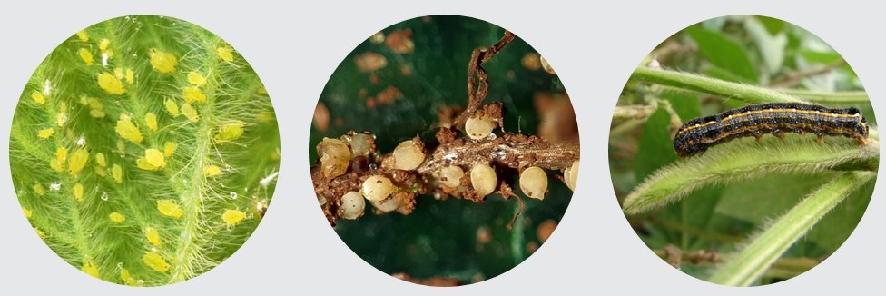
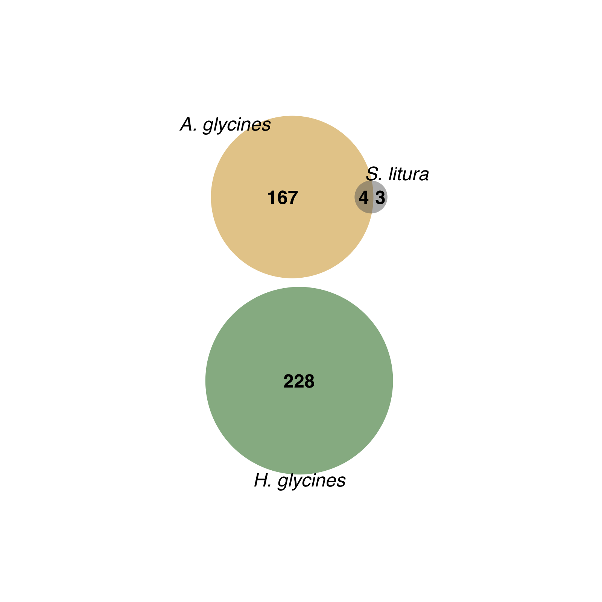
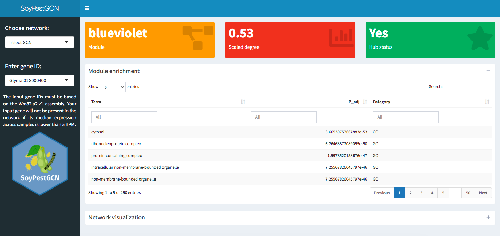

```{r setup, include=FALSE}
knitr::opts_chunk$set(
  warning = FALSE, 
  message = FALSE,
  echo = FALSE,
  fig.width = 7, fig.height = 2.5
)
options(htmltools.dir.version = TRUE)
```

```{r xaringan-fit-screen, echo=FALSE}
xaringanExtra::use_fit_screen()
```

```{r panels, echo=FALSE}
xaringanExtra::use_panelset()
```

```{r scribble, echo=FALSE}
xaringanExtra::use_scribble()
```


background-image: url(http://cdn.shopify.com/s/files/1/0722/2059/files/Soybean_large.jpg?v=1535003542)
background-position: 95% 50%
background-size: 45%

## Introduction

<br />

.pull-left[
Soybean exports: 2% of Brazil's GNP .cit[(EMBRAPA, 2020)]

Annual loss of billions of dollars .cit[(Osman et al., 2015)]
]

---

background-image: url(http://cdn.shopify.com/s/files/1/0722/2059/files/Soybean_large.jpg?v=1535003542)
background-position: 95% 50%
background-size: 45%

## Introduction

<br />

.pull-left[
Soybean exports: 2% of Brazil's GNP .cit[(EMBRAPA, 2019)].

Annual loss of billions of dollars .cit[(Osman et al., 2015)].

**Pest attack (insects and nematodes)** -  yield loss due to:

1. Leaf damage

2. Seed damage

3. Early senescence

4. Fewer nodules

.n[2030] Agenda: sustainable increase in crop yield.

.footnote[Source: BigHaat]

]

---

## The research problem

<br />

GWAS can identify .bgb[causative SNPs] associated with traits, but not .bgb[causative genes].

Current methods lead to high false-positive and false-negative rates.

<br />

.center[.font120[How do we confidently pick the causative gene(s)?]]

---

## A network-based solution

.footnote[Bandara *et al.*, 2020]
<br />

.bgb[Gene coexpression networks]: Nodes represent genes and edges represent their correlation coefficients.

In large-scale analyses, we can detect .bgp[coexpression modules] &rarr; functionally similar genes.

```{r echo=FALSE, out.width='75%', fig.align='center'}
knitr::include_graphics("https://github.com/almeidasilvaf/GCN_GWAS_fungi/blob/main/figs/redes_example1.png?raw=true")
```


---

## The rationale: guilt-by-association

```{r echo=FALSE, fig.align='center'}
suppressPackageStartupMessages(library(networkD3))
data("MisLinks")
data("MisNodes")
MisNodes$group <- 1
MisNodes$group[MisNodes$name == "Valjean"] <- 2
MisNodes$name[MisNodes$name == "Valjean"] <- "Guide"
cols <- JS('d3.scaleOrdinal().domain(["1", "2"]).range(["steelblue", "maroon"])')

forceNetwork(Links = MisLinks, Nodes = MisNodes,
            Source = "source", Target = "target",
            Value = "value", NodeID = "name",
            Group = "group", colourScale = JS(cols),
            opacity = 0.9, height=600, width=1200)
```

---

## Goal

<br />
.center[.font120[Identify high-confidence candidate genes involved in resistance to fungal diseases by integrating GWAS and coexpression networks]]

---

background-image: url(figs/pgce/methods.png)
background-size: contain

## Methods

---

## {cageminer}'s algorithm

```{r out.width='95%', fig.align='center'}
knitr::include_graphics("https://github.com/almeidasilvaf/bioc2021/blob/master/figs/Fig1.png?raw=true")
```

---

background-image: url(figs/soypestgcn/frequency_of_snps_and_transcriptome_samples_overlap.png)
background-position: 95% 50%
background-size: 45% 90%

## Data overview

<br />

.pull-left[
.brand-charcoal[.font130[.bold[Filtering criterion:]]]

A species must be represented by:
- transcriptome samples
- GWAS-derived SNPs
]

---

## Data overview

```{r fig.align='center'}

```

&emsp;&emsp;&emsp;&nbsp; .font130[*Aphis glycines*] 
&emsp;&emsp;&emsp;&emsp;&emsp;&nbsp; .font130[*Heterodera glycines*]
&emsp;&emsp;&emsp;&emsp;&emsp; .font130[*Spodoptera litura*]

.footnote[Source: Soybean research and information network | Campo e Negócio | Syngenta]

---

## Prioritized candidate genes

.pull-left[

<br />

- *A. glycines:* **171** 

- *S. litura:* **7** 

- *H. glycines:* **228** 

Significant overlap of candidate genes between insects, but not between insects and nematodes.

]

.pull-right[
```{r venn, echo=FALSE}

```
]

---

background-image: url(figs/soypestgcn/candidates_classification_final.png)
background-size: 50%
background-position: 95% 50%

## A network of processes

<br />
.pull-left[
Both well-known and novel candidates.

Most candidates likely involved in .bgp[signaling]. .bgp[oxidative stress], and .bgp[transcriptional regulation].

Hidden treasure? 14.78% (55/372) of the candidates encode proteins of unknown function.

]

---

background-image: url(figs/soypestgcn/top_genes.png)
background-position: 95% 65%
background-size: 45%

## Promising targets for genetic engineering

<br />
.pull-left[
Candidates were scored and ranked with:

.font140[
$$CS_i = r_{pb} \kappa$$
] 

where:


$$\kappa = 2 \text{ if the gene is a transcription factor}$$


$$\kappa = 2 \text{ if the gene is a hub}$$


$$\kappa = 3 \text{ if the gene is a hub and a transcription factor}$$

]

---

## Potential accessions in the USDA germplasm

<br />

**Goal:** .bgb[largest] number of .bgb[resistance SNPs] and .bgr[smallest] number of .bgr[susceptibility SNPs].

<br />

--

.pull-left[


.font140[
.blue[.bold[A &rarr; G]] `r emo::ji("grinning_face")` 👍🏼  

$S(GG) = 2$

$S(AG) = 1$

$S(AA) = 0$
]
]

--

.pull-right[

.font140[
.red[.bold[A &rarr; G]] `r emo::ji("fearful_face")` 👎🏻  

$S(GG) = 0$

$S(AG) = 1$

$S(AA) = 2$
]
]

---

background-image: url(figs/soypestgcn/accessions.png)
background-position: 95% 50%

## Potential accessions in <br /> the USDA germplasm

<br />
.pull-left[

$$S_{total} = \sum\limits_{i=1}^nS_i \text{ where }S_i = \{0,1,2\}$$

.font110[Main findings:]

- There is still room for alelle pyramiding
- Best accessions can be improved through MAS-based breeding or genetic engineering

]

---

## A web app to facilitate data reuse

```{r out.width='95%', fig.align='center'}

```

---

background-image: url(http://www.mcgilltribune.com/wp-content/uploads/2019/11/gene_editing.jpg)
background-position: 95% 50%
background-size: 40%

## Conclusions

.pull-left[
We found high-confidence candidates that can be used to increase soybean resistance to fungal diseases through:

- Gene editing

- Plant transformation

.footnote[Source: The McGill Tribune]

]

---

background-image: url(https://www.agroscope.admin.ch/agroscope/en/home/topics/plant-production/plant-breeding/ackerpflanzen/selection_soja/_jcr_content/par/columncontrols/items/1/column/image/image.imagespooler.jpg/1473888418017/selection_soja_fleur.jpg)
background-position: 95% 50%
background-size: 40%

## Conclusions

.pull-left[
We found high-confidence candidates that can be used to increase soybean resistance to fungal diseases through:

- Gene editing

- Plant transformation

We found promising accessions in the USDA germplasm that can be used in:

- Breeding programs

- CRISPR/Cas-mediated editing to insert missing alleles.

.footnote[Source: Agroscope]
]

---

class: sydney-yellow, middle, center

## Contact:

`r icons::fontawesome("envelope")`  [fabricio_almeidasilva@hotmail.com](mailto:fabricio_almeidasilva@hotmail.com)

`r icons::fontawesome("twitter")`  [@almeidasilvaf](https://twitter.com/almeidasilvaf)

`r icons::fontawesome("globe")`  [almeidasilvaf.github.io](https://almeidasilvaf.github.io/home/)

`r icons::fontawesome("github")`  [almeidasilvaf](https://github.com/almeidasilvaf/)


