```{r setup, include=FALSE}
knitr::opts_chunk$set(
  warning = FALSE, 
  message = FALSE,
  echo = FALSE,
  fig.width = 7, fig.height = 2.5
)
options(htmltools.dir.version = TRUE)
```

```{r xaringan-fit-screen, echo=FALSE}
xaringanExtra::use_fit_screen()
```

```{r panels, echo=FALSE}
xaringanExtra::use_panelset()
```

## Why soybean?

.footnote[Image credit: Kelly Sikkema]

.pull-left[
<br />
.bgb[Food security:] <br />
Human and animal nutritional: oil and protein content.

.bgb[Economy:] <br />
Soybean exports: 2% of Brazil's GNP .cit[(EMBRAPA, 2020)].

.bgb[Ecology:] <br />
Biological nitrogen fixation in root nodules.

]

.pull-right[
```{r}
knitr::include_graphics("https://images.unsplash.com/photo-1572457224112-06d191bb6d01?ixid=MnwxMjA3fDB8MHxwaG90by1wYWdlfHx8fGVufDB8fHx8&ixlib=rb-1.2.1&auto=format&fit=crop&w=816&q=80")
```

]

---

background-image: url(figs/sbv/paper_YvdP.png)
background-position: 95% 80%
background-size: 45%

## The soybean genome

.footnote[Qiao *et al.*, 2019. Genome Biology | Van de Peer *et al.*, 2021. The Plant Cell]

.pull-left[
<br />
First published in .n[2010].

52,872 genes (latest assembly).

Strong signatures of 2 WGD (polyploidization) events:

  - .bgp[~58 mya:] legume WGD 
  - .bgp[~13 mya:] Glycine-specific WGD
  
Polyploidy provides genomes with the raw material for genetic innovation, especially under rough conditions.

Soybean as a model for evolutionary genomics.
]

.pull-right[
```{r}
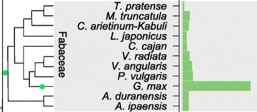
```
]

---

background-image: url(figs/sbv/soybean_functional_genomics.png)
background-position: 95% 50%
background-size: 50%

## Soybean functional genomics over the past decade

.footnote[Zhang *et al.*, 2021. Plant Biotechnology Journal]

.pull-left[
<br />
Increasing number of studies to explore:

- genetic diversity
- trait-associated markers (GWAS)
- spatiotemporal dynamics of:
  - gene expression (transcriptomics)
  - protein accumulation (proteomics)
  - metabolites (metabolomics)
  - epigenetic changes (epigenomics)
]

---

background-image: url(figs/sbv/soybean_functional_genomics.png)
background-position: 95% 50%
background-size: 50%

## Soybean functional genomics over the past decade

.footnote[Zhang *et al.*, 2021. Plant Biotechnology Journal]

.pull-left[
<br />
Increasing number of studies to explore:

- genetic diversity
- trait-associated markers (GWAS)
- spatiotemporal dynamics of:
  - .bgb[gene expression (transcriptomics)]
  - protein accumulation (proteomics)
  - metabolites (metabolomics)
  - epigenetic changes (epigenomics)
]

---

background-image: url(figs/sbv/sea.png)
background-position: 95% 70%
background-size: 50%

## The Soybean Expression Atlas

.footnote[Machado *et al.*, 2020. The Plant Journal]

.pull-left[
<br />
Systematic pre-processing and analysis of >.n[1200] RNA-seq samples.


]

---

background-image: url(figs/sbv/sea_clustering.png)
background-position: 95% 50%
background-size: 40%

## The Soybean Expression Atlas

.footnote[Machado *et al.*, 2020. The Plant Journal]

.pull-left[
<br />
Systematic pre-processing and analysis of >.n[1200] RNA-seq samples.

Overall high-quality of samples. 

Samples cluster into 3 major groups:

- aerial parts
- underground parts
- seed and seed-related parts

]

---

background-image: url(figs/sbv/sea_webapp.png)
background-position: 95% 50%
background-size: 48%

## The Soybean Expression Atlas

.footnote[Machado *et al.*, 2020. The Plant Journal]

.pull-left[
<br />
Systematic pre-processing and analysis of >.n[1200] RNA-seq samples.

Overall high-quality of samples. 

Samples cluster into 3 major groups:

- aerial parts
- underground parts
- seed and seed-related parts

Web interface for easy data download and reuse.

Over .n[200] recurring users, who are mainly from the USA and China.

]

---

## The Soybean Expression Atlas

<br />
```{r fig.align='center', out.width='90%'}
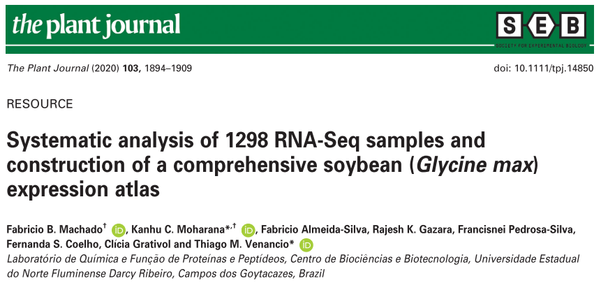
```

---

class: center, inverse, middle

# Are we done yet?

---

background-image: url(figs/sbv/paper_isp_figure1.png)
background-position: 95% 75%
background-size: 43%

## Exponential accumulation of RNA-seq data

.footnote[Almeida-Silva *et al.*, 2021. in silico Plants]

.pull-left[
<br />
Dozens of samples are submitted every month.

Most groups generating new transcriptome data are in China,
the USA, and Brazil.

New versions of the Soybean Expression Atlas will be released biannually.

Soybean Expression Atlas v.n[2.0]:
- Release in mid-.n[2022]
- Probably .bgp[3x more samples].
]

---

class: inverse, center, middle

# Exploring the complexity of soybean (*Glycine max*) transcriptional regulation using global gene co-expression networks

---

background-image: url(figs/sbv/gcn_module.png)
background-position: 95% 50%
background-size: 50%

## Motivation

.footnote[Yang *et al.*, 2010. Genome Research]

.pull-left[
<br />

Classical transcriptomic studies are limited to particular conditions or case-control setups.


Large-scale coexpression networks can reveal patterns that individual studies cannot, such as:

- sets of co-regulated genes and their regulators

- pathways associated with unique transcriptional profiles

- evolutionary trends, especially among duplicated genes.

]

---

## Aims

<br />

- Unravel biological processes and metabolic pathways associated with each module.

- Identify tissues where each module's expression is enhanced or repressed.

- Predict the regulators of each module's expression.

- Elucidate the fates of duplicated genes at the transcriptional level.

---

background-image: url(figs/sbv/planta_fig1.png)
background-position: 95% 75%
background-size: 55%

## Module hubs uncover biological processes associated with specific tissues

.footnote[Almeida-Silva *et al.*, 2020. Planta]
.pull-left-1[
<br />
9 modules were enriched in GO terms, pathways and protein domains.

.bgb[Guilt-by-association:] Functional prediction of 93 unannotated hubs.

Hubs are enriched in essential genes (i.e. embryonic lethal genes).
]

---

## Major regulators of important biological processes

.footnote[Almeida-Silva *et al.*, 2020. Planta]
<br />

```{r fig.align='center', out.width='90%'}
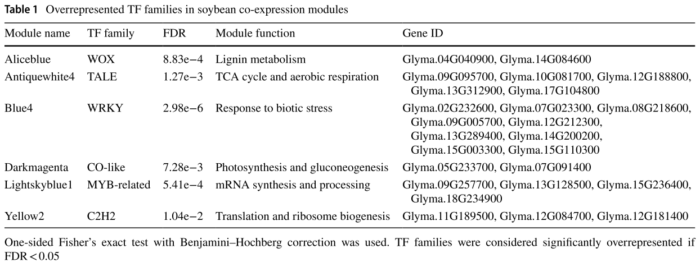
```

---

background-image: url(figs/sbv/planta_fig2.png)
background-position: 95% 70%
background-size: 50%

## Network topology and the possible fate of soybean duplicated genes

.footnote[Almeida-Silva *et al.*, 2020. Planta]
.pull-left[
<br />
Most pairs displayed divergent expression profiles or signs of fractionation.

Greater levels of co-occurrence in modules for WGD-derived pairs (especially from the 13 WGD).
  
  - Increased retention of WGD duplicates involved in intricate systems.
  
Frequency of co-occurrence in modules is higher than the expected by chance.

  - transcriptional similarity of part of the duplicates under selective pressures.
  
]

---

## Further reading

.footnote[Almeida-Silva *et al.*, 2020. Planta]
<br /> 
<br />
```{r fig.align='center', out.width='95%'}
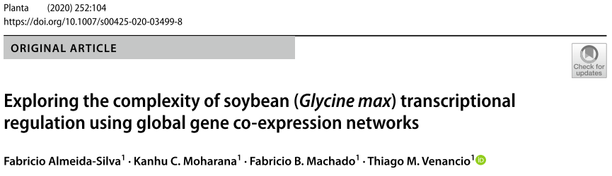
```

---

class: inverse, center, middle

# Integration of genome-wide association studies and gene coexpression networks unveils promising soybean resistance genes against five common fungal pathogens

---

## Motivation

.pull-left[
<br />
Fungal diseases in soybean crops lead to annual losses of billions of dollars.

GWAS can identify .bgb[causative SNPs] associated with traits, but not .bgb[causative genes].

Current methods lead to high false-positive and false-negative rates.
]

.pull-right[
```{r}
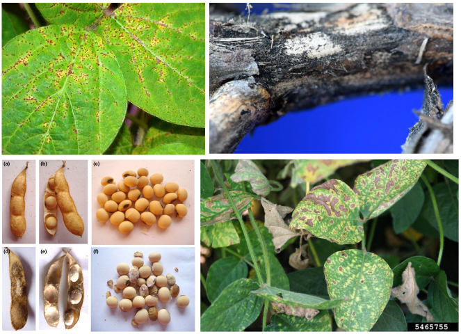
```
]

<br />

.center[.font130[How do we confidently pick the causative gene(s)?]]

---

## The rationale: guilt-by-association

```{r echo=FALSE, fig.align='center'}
suppressPackageStartupMessages(library(networkD3))
data("MisLinks")
data("MisNodes")
MisNodes$group <- 1
MisNodes$group[MisNodes$name == "Valjean"] <- 2
MisNodes$name[MisNodes$name == "Valjean"] <- "Guide"
cols <- JS('d3.scaleOrdinal().domain(["1", "2"]).range(["steelblue", "maroon"])')

forceNetwork(Links = MisLinks, Nodes = MisNodes,
            Source = "source", Target = "target",
            Value = "value", NodeID = "name",
            Group = "group", colourScale = JS(cols),
            opacity = 0.9, height=600, width=1200)
```

---

## Aim

<br />
.center[.font120[Identify high-confidence candidate genes involved in resistance to fungal diseases by integrating GWAS and coexpression networks]]

----

.font160[ .brand-blue[ Challenges] ] 

- Inferring coexpression networks is very hard, especially due to data pre-processing.
- Lack of existing methods to integrate GWAS and coexpression networks as we wanted.

---

## Aim

<br />
.center[.font120[Identify high-confidence candidate genes involved in resistance to fungal diseases by integrating GWAS and coexpression networks]]

----

.font160[ .brand-blue[ Challenges] ]

- .bgp[Inferring coexpression networks is very hard, especially due to data pre-processing.]
- Lack of existing methods to integrate GWAS and coexpression networks as we wanted.


---

class: sydney-yellow, middle
background-image: url(figs/sbv/bionero_logo.png)
background-position: 95% 50%
background-size: 35%

.pull-left-2[
## .bold[.dark-blue[BioNERO: an all-in-one R/Bioconductor package for comprehensive and easy biological network reconstruction]]
]

---

background-image: url(figs/sbv/bionero_workflow.png)
background-position: 97% 50%
background-size: 55%

## BioNERO

.footnote[Almeida-Silva *et al.*, 2021. Functional and Integrative Genomics]

.pull-left[
<br />
R/Bioconductor package that features:
- expression data preprocessing
- gene coexpression network inference
- gene regulatory network inference
- module detection and network statistics
- functional analyses
- network visualization
- network comparison
]

---

background-image: url(figs/sbv/bionero_plots.png)
background-position: 97% 50%
background-size: 50%

## BioNERO

.footnote[Almeida-Silva *et al.*, 2021. Functional and Integrative Genomics]

.pull-left[
<br />
R/Bioconductor package that features:
- expression data preprocessing
- gene coexpression network inference
- gene regulatory network inference
- module detection and network statistics
- functional analyses
- network visualization
- network comparison
]

---

## BioNERO

<br />
.footnote[Almeida-Silva *et al.*, 2021. Functional and Integrative Genomics]

```{r fig.align='center', out.width='80%'}
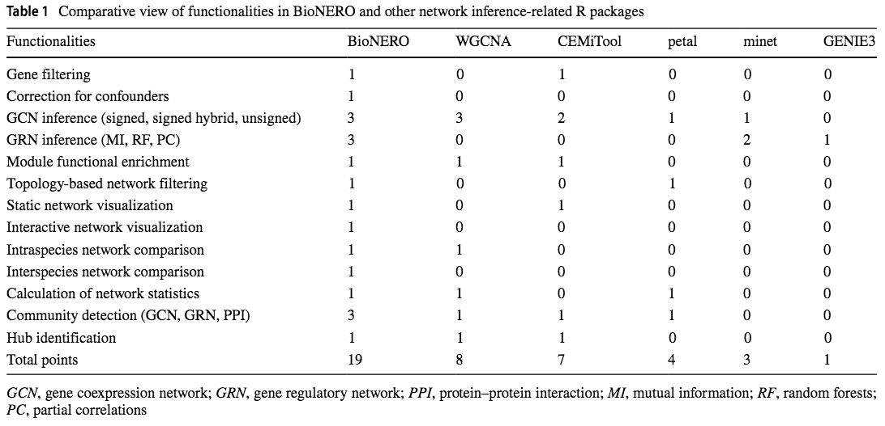
```

.center[BioNERO outperforms all existing network inference-related packages.]

---

## BioNERO


```{r fig.align='center', out.width='50%'}
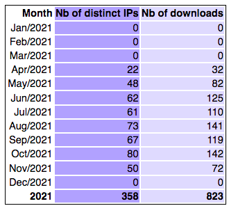
```

---

## Further reading

<br />
<br />

```{r fig.align='center', out.width='100%'}
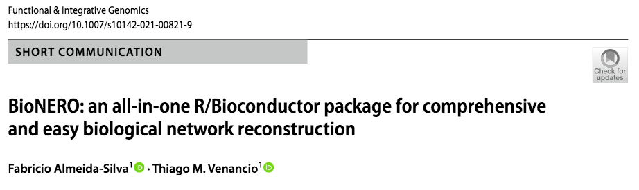
```

---

## Aim

<br />
.center[.font120[Identify high-confidence candidate genes involved in resistance to fungal diseases by integrating GWAS and coexpression networks]]

----

.font160[ .brand-blue[ Challenges] ] 

- `r emo::ji("check")` &nbsp;Inferring coexpression networks is very hard, especially due to data pre-processing.
- .bgp[Lack of existing methods to integrate GWAS and coexpression networks as we wanted.]

---

class: sydney-grey, middle
background-image: url(figs/sbv/cageminer_logo.png)
background-position: 95% 50%
background-size: 35%

.pull-left-2[
## .bold[cageminer: an R/Bioconductor package to prioritize candidate genes by integrating GWAS and gene coexpression networks]
]

---

## cageminer

```{r out.width='95%', fig.align='center'}
knitr::include_graphics("https://github.com/almeidasilvaf/bioc2021/blob/master/figs/Fig1.png?raw=true")
```

---

## cageminer

```{r fig.align='center', out.width='50%'}
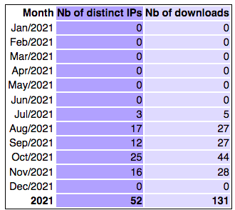
```

---

## Further reading

<br />
<br />

```{r fig.align='center', out.width='100%'}
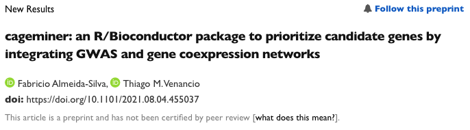
```

---

## Aim

<br />
.center[.font120[Identify high-confidence candidate genes involved in resistance to fungal diseases by integrating GWAS and coexpression networks]]

----

.font160[ .brand-blue[ Challenges] ] 

- `r emo::ji("check")` &nbsp;Inferring coexpression networks is very hard, especially due to data pre-processing.
- `r emo::ji("check")` &nbsp;Lack of existing methods to integrate GWAS and coexpression networks as we wanted.

.center[.font140[Good to go!]]

---

background-image: url(https://github.com/almeidasilvaf/GCN_GWAS_fungi/blob/main/figs/frequency_of_snps_and_transcriptome_samples_overlap.png?raw=true)
background-position: 95% 50%
background-size: 45% 90%

## Data overview

<br />

.pull-left[
.brand-charcoal[.font130[.bold[Filtering criterion:]]]

A species must be represented by:
- transcriptome samples
- GWAS-derived SNPs
]

---

background-image: url(figs/pgce/pathogens.png)
background-size: 80%
background-position: 50% 70%

## Data overview

.footnote[Source: Crop Protection Network | Chiotta *et al.*, 2016 | Daren Mueller | Elevagro | Agrolink]

---

## Prioritized candidate genes

.pull-left[

<br />

- *Cadophora gregata:* **11** 

- *Fusarium graminearum:* **59** 

- *Fusarium virguliforme:* **191** 

- *Macrophomina phaseolina:* **8** 

- *Phakopsora pachyrhizi:* **3** 

Highly .bgp[species-specific] response.

]

.pull-right[
```{r venn, echo=FALSE}
knitr::include_graphics("https://github.com/almeidasilvaf/GCN_GWAS_fungi/blob/main/figs/venn_diagram_candidates.png?raw=true")
```
]

---

background-image: url(figs/pgce/Fig3.png)
background-size: 50%
background-position: 95% 50%

## A network of processes

<br />
.pull-left[
Both well-known and novel candidates.

Most candidates likely involved in .bgp[defense signaling].

Hidden treasure? 8% of the candidates encode proteins of unknown function.

]

---

background-image: url(figs/pgce/table_top_genes.png)
background-position: 95% 65%
background-size: 45%

## Promising targets for genetic engineering

<br />
.pull-left[
Candidates were scored and ranked with:

.font140[
$$CS_i = r_{pb} \kappa$$
] 

where:

$$\kappa = 2 \text{ if the gene is a transcription factor}$$

$$\kappa = 2 \text{ if the gene is a hub}$$ 

$$\kappa = 3 \text{ if the gene is a hub and a transcription factor}$$

]

---

## Potential accessions in the USDA germplasm

<br />

**Goal:** .bgb[largest] number of .bgb[resistance SNPs] and .bgr[smallest] number of .bgr[susceptibility SNPs].

<br />

--

.pull-left[


.font140[
.blue[.bold[A &rarr; G]] `r emo::ji("grinning_face")` 👍🏼  

GG = 2

AG = 1

AA = 0
]
]

--

.pull-right[

.font140[
.red[.bold[A &rarr; G]] `r emo::ji("fearful_face")` 👎🏻  

GG = 0

AG = 1

AA = 2 
]
]

---

background-image: url(figs/pgce/top_accessions.png)
background-position: 95% 50%

## Potential accessions in <br /> the USDA germplasm

<br />
.pull-left[

$$S_{total} = \sum\limits_{i=1}^nS_i \text{ where }S_i = \{0,1,2\}$$

.font110[Main findings:]

- There is still room for alelle pyramiding
- Best accessions can be improved through MAS-based breeding or genetic engineering

]

---

## A web app to facilitate data reuse

Users can explore the coexpression network we inferred at https://soyfungigcn.venanciogroup.uenf.br.

<iframe src="https://soyfungigcn.venanciogroup.uenf.br/" width='100%' height='80%' title="SoyFungiGCN">

---

## Further reading

<br />
<br />
```{r fig.align='center', out.width='90%'}
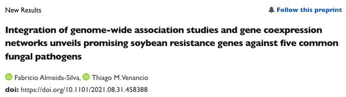
```

---

## Conclusion and take-home messages

<br />
- The Soybean Expression Atlas is one the largest plant transcriptome databases.

--

- Gene networks are great tools to .bgb[surf the transcriptomic data tsunami], with a plethora of possible applications (from evolutionary analyses to gene discovery).

--

- **BioNERO** makes network inference and analysis fairly easy tasks.

--

- **cageminer** can (and probably will) be used to mine candidate genes associated with many other important traits.

--

- As new data are generated, sequencing becomes less useful. Extracting knowledge from existing data is our current challenge.

---

background-image: url(figs/sbv/acknowledgements.jpg)
background-size: contain

---

background-image: url(figs/sbv/future_steps.jpg)
background-size: contain

## A new adventure

---

class: sydney-yellow, middle, center

## You can find me at:

`r icons::fontawesome("envelope")`  [fabricio_almeidasilva@hotmail.com](mailto:fabricio_almeidasilva@hotmail.com)

`r icons::fontawesome("globe")`  [almeidasilvaf.github.io](https://almeidasilvaf.github.io/)


`r icons::fontawesome("twitter")`  [@almeidasilvaf](https://twitter.com/almeidasilvaf)


`r icons::fontawesome("github")`  [almeidasilvaf](https://github.com/almeidasilvaf/)

