```{r setup, include=FALSE}
knitr::opts_chunk$set(
  warning = FALSE, 
  message = FALSE,
  echo = FALSE,
  fig.width = 7, fig.height = 2.5
)
options(htmltools.dir.version = TRUE)
```

```{r xaringan-fit-screen, echo=FALSE}
xaringanExtra::use_fit_screen()
```

```{r panels, echo=FALSE}
xaringanExtra::use_panelset()
```

background-image: url(https://github.com/almeidasilvaf/GCN_GWAS_fungi/blob/main/figs/intro4.png?raw=true)
background-position: 95% 50%
background-size: 45%

## Introduction

<br />

.footnote[Song *et al.*, 2020]

.pull-left[
Arms race in plant defense:

- PAMP-triggered immunity (PTI)

- Effector-triggered immunity (ETI)

Several associated genes, e.g.:

1. Recognition

2. Signal transduction

3. ROS production and oxidative burst

4. Physical barriers

5. .bgp[Pathogenesis-related proteins]

]

---

## Pathogenesis-related (PR) proteins

.footnote[Moosa *et al.*, 2017]

<br />
PR proteins are classified in 17 families based on their sequence similarities, enzymatic activities and structural properties.

```{r out.width='890%', fig.align='center'}
knitr::include_graphics("https://www.researchgate.net/profile/Shahbaz-Sahi/publication/315476424/figure/tbl1/AS:613911694942262@1523379362944/Classification-of-PR-proteins.png")
```

---

## PR-1

<br />
PR-1-encoding genes are present in all plant taxa.

--

First identified in tobacco leaves infected with TMV: 2% of the proteins, suggesting a role in plant defense.

--

Widely neglected PR family.

--

Stress-responsive, but they also have endogenous functions.

- PR or PR-like?

--

Plants overexpressing PR-1 genes have increased resistance against fungi, oomycetes and bacteria.

--

Recent identification of a conserved CAP domain (cysteine-rich secretory protein, antigen 5, pathogenesis-related 1) in all PR-1.

---

## The CAP domain (PF00188)

<br />
Binding and sequestration of sterols in pathogens' membranes.

- further evidence: more effective against sterol auxotrophs.

--

Typically folds into 4 $\alpha$-helices and 4 $\beta$-strands stabilized by disulfide bonds.

--

Last 11 residues can be cleaved and release a CAP-derived (CAPE) peptide.

--

CAPE peptide does not induce expression of WRKY TFs: independent signaling pathway.

---

## The research problem

<br />
- Unexplored PR family in plants. Never fully characterized in soybean.

- Are PR-1 genes promising targets for biotechnological applications in soybean?

---

## Goals

<br />
- Identify and characterize soybean genes encoding PR-1 genes at the .blue[sequence], .dark-orange[structure], and .green[expression] levels to fill the following gaps:

1. .blue[How many phylogenetically distinct groups are there?]

--

1. .blue[How did they emerge?]

--

1. .dark-orange[What are the physicochemical properties of soybean PR-1 proteins?]

--

1. .dark-orange[Are primary and tertiary structures conserved?]

--

1. .dark-orange[Do gene structures reflect the phylogeny?]

--

1. .green[How are PR-1 genes regulated?]

--

1. .green[Which genes are constitutively expressed and which are stress-specific?]

--

1. .green[Which stress conditions can induce PR-1 gene expression?]

---

## Identification of *GmPR-1* genes

<br />
- .bgg[Method:] BLASTp search using *A. thaliana* PR-1 genes as queries (E-value: 1e-10).
- 24 *GmPR-1* genes, all of which contain the CAP domain.

---

background-image: url(figs/pr1/tabela_pr1.png)
background-size: contain

.bgg[Method:] <br />
 R/Biostrings <br />
 R/Peptides <br />
 GOCC: Soybase <br />
 SignalP 5.0 <br />
 Phyre2

---

## A large deletion removed the CAP domain of a *GmPR-1*

.pull-left-2[
```{r}
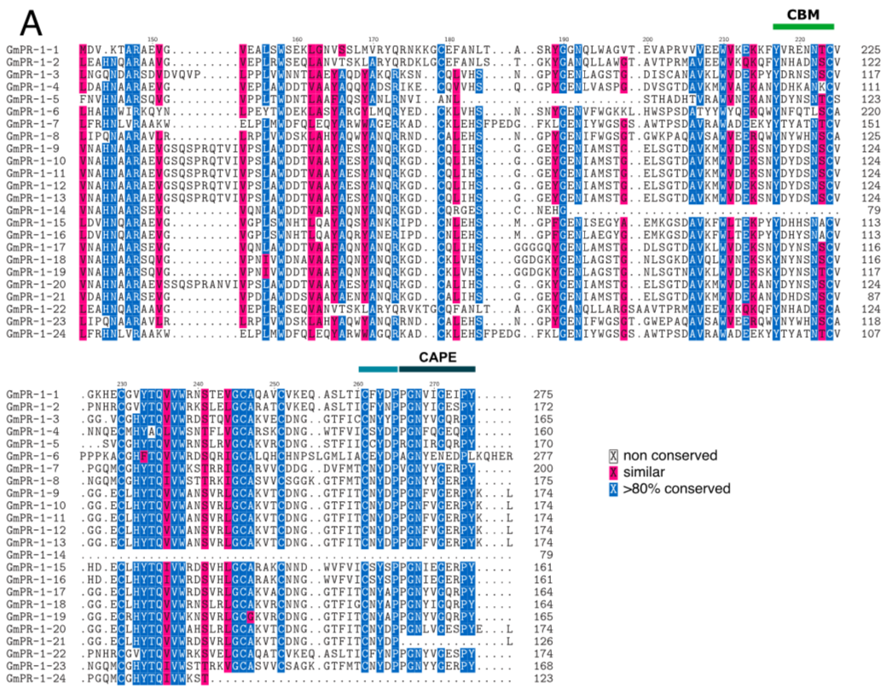
```
]

.pull-right-1[
```{r}
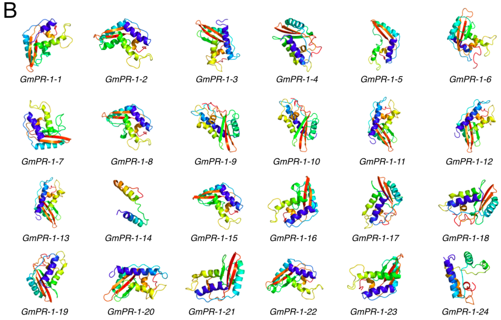
```

.bgg[Method:] <br />
MAFFT

]

---

## A large deletion removed the CAP domain of a *GmPR-1*

.pull-left-1[
```{r}

```

.bgg[Method:] <br />
Phyre2

]

.pull-right-2[
```{r}

```
]

---

## Recent local duplications shaped GmPR-1 expansion

```{r out.width='60%', fig.align='center'}
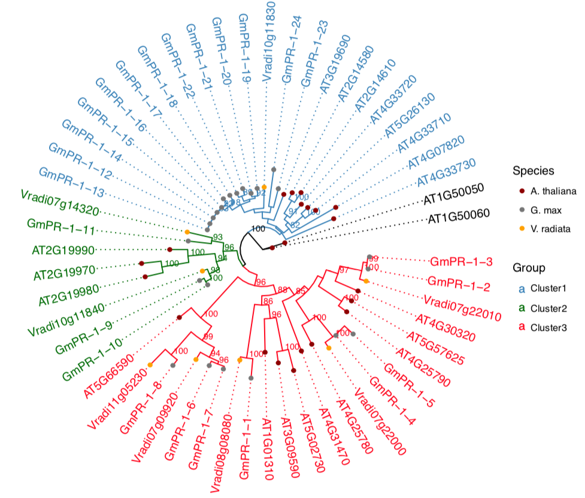
```

---

.pull-left-1[
2 phylogenetic groups.
]

.pull-right-2[
```{r}
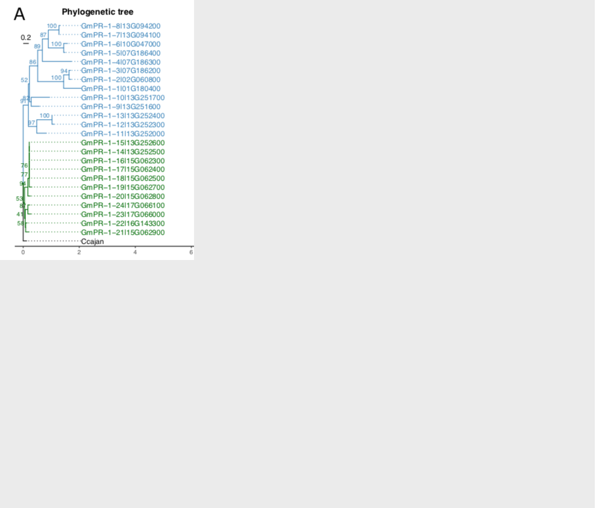
```
]

---

.pull-left-1[
2 phylogenetic groups.

3 genes with 2+ exons (PR-1 genes in other species are intronless)


]

.pull-right-2[
```{r}
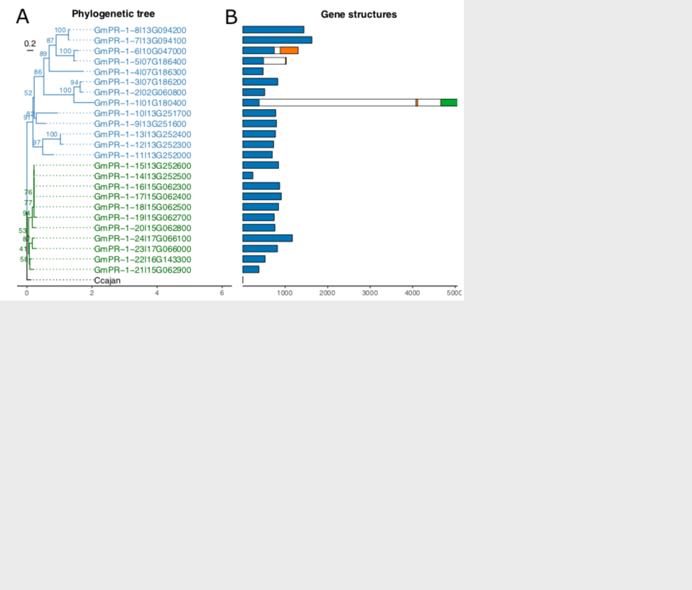
```
]

---

.pull-left-1[
2 phylogenetic groups.

3 genes with 2+ exons (PR-1 genes in other species are intronless)

Number of  genes and motifs reflect phylogeny.

]

.pull-right-2[
```{r}
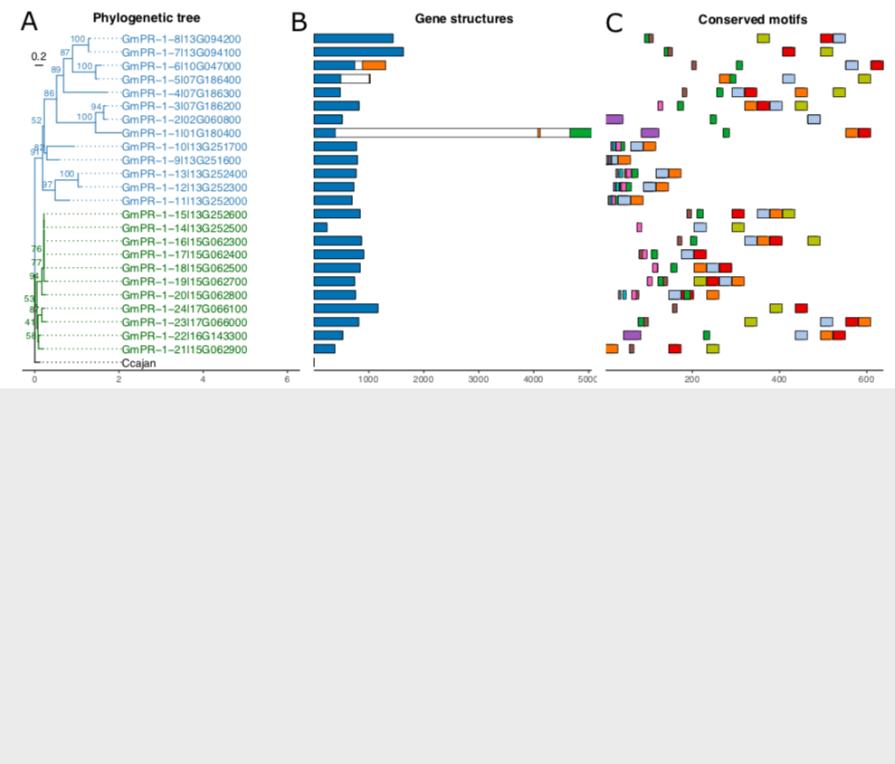
```
]

---

.pull-left-1[
2 phylogenetic groups.

3 genes with 2+ exons (PR-1 genes in other species are intronless)

Number of  genes and motifs reflect phylogeny.

GmPR-1 duplicates under strong purifying selection.

- 48% DD 
- 24% WGD 
- 12% TRD 
- 10% PD 
- 7% TD
]

.pull-right-2[
```{r}
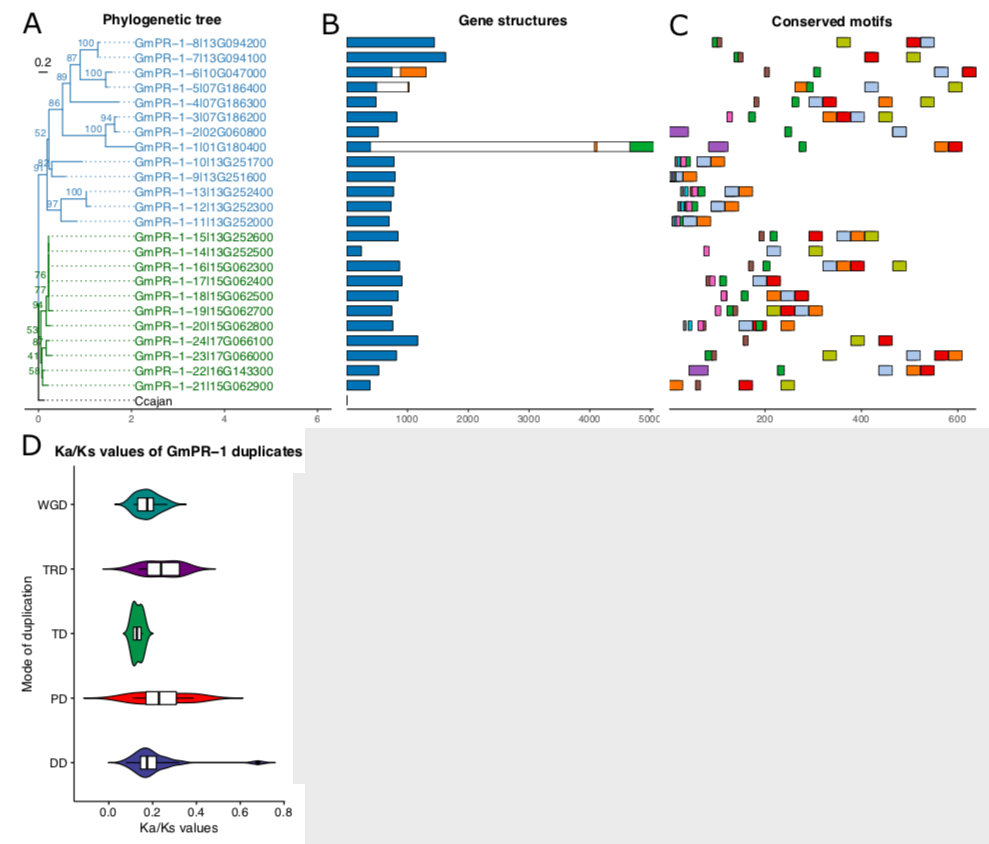
```
]

---

.pull-left-1[
2 phylogenetic groups.

3 genes with 2+ exons (PR-1 genes in other species are intronless)

Number of  genes and motifs reflect phylogeny.

GmPR-1 duplicates under strong purifying selection.

- 48% DD 
- 24% WGD 
- 12% TRD 
- 10% PD 
- 7% TD


Most abundant CREs are associated with stresses (C2H2, WRKY, NAC, GATA, ERF).
]

.pull-right-2[
```{r}
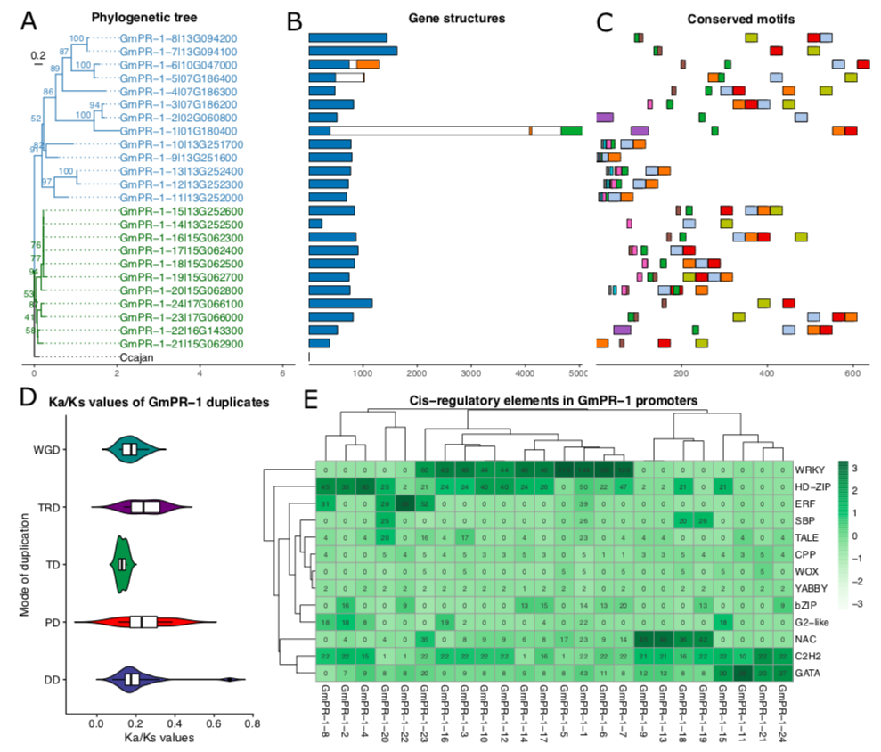
```
]

---

## Ancient WGD contributed to *GmPR-1* gene expansion

<br />

Whole-genome duplications are the second main mechanism for *GmPR-1* expansion.


$$
DT (mya) = \frac{Ks}{2 \times 6.1e-09 \times 1e06}
$$

Most WGD-derived genes diverged in the 58 mya WGD event or in even more ancient events. 

---

## Most *GmPR-1* genes are PR-like proteins

<br />

```{r}
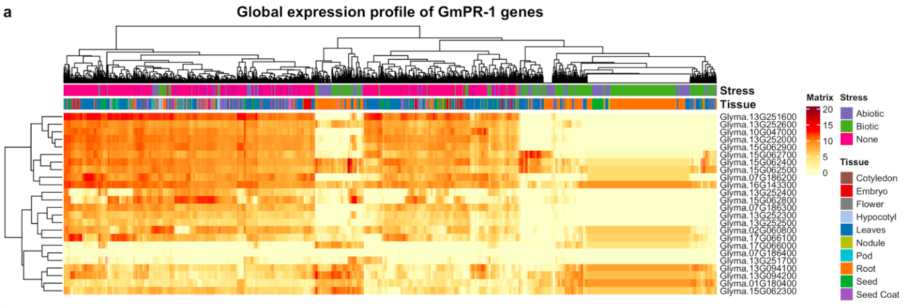
```

23 of 24 *GmPR-1* genes are also expressed in healthy conditions (PR-like, probable endogenous function).

---

## *GmPR-1* gene expression tends to be tissue-specific

.pull-left[
<br />
$\tau$ index of tissue specificity:

- $\tau$ close to 1: tissue-specific profile.
- $\tau$ close to .n[0]: broad expression profile.

$\tau$ indices are closer to 1.
]

.pull-right[
```{r out.width='100%'}
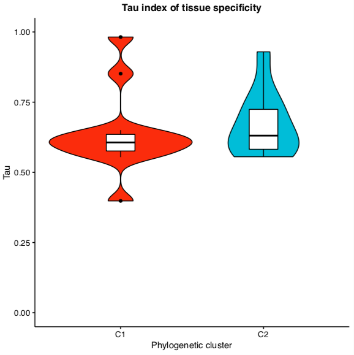
```
]

---

## *GmPR-1* expression is modulated by abiotic stress

```{r}
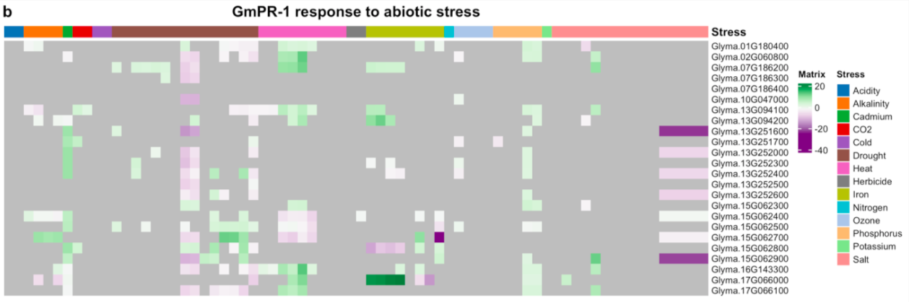
```

86% (21/24) of the *GmPR-1* genes are up-regulated under at least one
abiotic stress condition, such as:
- alkalinity, salt, cadmium, drought, heat, herbicide, high ozone levels, and Fe and P deficiency.

---

## *GmPR-1* expression is modulated by biotic stress

```{r}
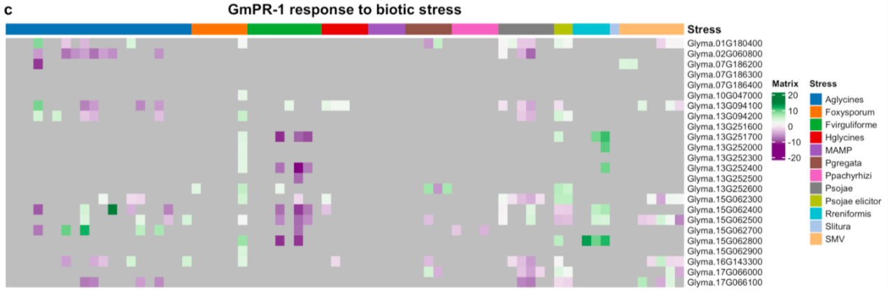
```

.n[20/24] GmPR-1 genes are up-regulated by at least one biotic stress, such as:

- fungi (*Fusarium oxysporum*, *Fusarium virguliforme*, *Cadophora gregata*, and *Phakopsora pachyrhizi*), insect (*Aphis glycines*), nematodes (*Heterodera glycines*, *Rotylenchulus reniformis*), oomycete (*Phytophthora sojae*) and virus (*soybean mosaic virus*).

---

## *GmPR-1* expression is modulated by biotic stress

```{r}

```

*Phytophthora sojae* and *Fusarium virguliforme* systematically repressed the expression of GmPR-1 genes.

GmPR-1-1, GmPR-1-16 and GmPR-1-18 were upregulated in the greatest number of biotic stresses, and GmPR-1-7, GmPR-1-21, GmPR-1-22 in abiotic stresses &rarr; potential targets for biotechnological applications.

---

## Want more details? Read the preprint!

<br />
```{r fig.align='center', out.width='80%'}

```

.center[.n[https://www.biorxiv.org/content/10.1101/2021.03.27.437342v1]]

---

class: sydney-yellow, middle, center

## You can find me at:

`r icons::fontawesome("envelope")`  [fabricio_almeidasilva@hotmail.com](mailto:fabricio_almeidasilva@hotmail.com)

`r icons::fontawesome("globe")`  [almeidasilvaf.github.io](https://almeidasilvaf.github.io/)


`r icons::fontawesome("twitter")`  [@almeidasilvaf](https://twitter.com/almeidasilvaf)


`r icons::fontawesome("github")`  [almeidasilvaf](https://github.com/almeidasilvaf/)

