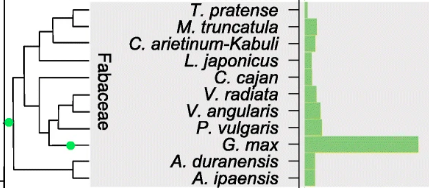
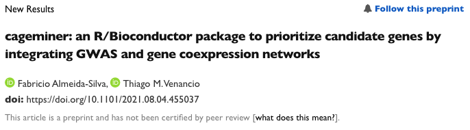

```{r setup, include=FALSE}
knitr::opts_chunk$set(
  warning = FALSE, 
  message = FALSE,
  echo = FALSE,
  fig.width = 7, fig.height = 2.5,
  cache = TRUE
)
options(htmltools.dir.version = TRUE)
```

```{r xaringan-fit-screen, echo=FALSE}
xaringanExtra::use_fit_screen()
```

```{r panels, echo=FALSE}
xaringanExtra::use_panelset()
```

```{r scribble, echo=FALSE}
xaringanExtra::use_scribble()
```

```{r tile_view, echo=FALSE}
xaringanExtra::use_tile_view()
```

## Why soybean?

.footnote[Image credit: Kelly Sikkema]

.pull-left[
<br />
.bgb[Food security:] <br />
Human and animal nutrition: oil and protein content.

.bgb[Economy:] <br />
Soybean exports: 2% of Brazil's GNP .cit[(EMBRAPA, 2020)].

.bgb[Ecology:] <br />
Biological nitrogen fixation in root nodules.

]

.pull-right[
```{r}
knitr::include_graphics("https://images.unsplash.com/photo-1572457224112-06d191bb6d01?ixid=MnwxMjA3fDB8MHxwaG90by1wYWdlfHx8fGVufDB8fHx8&ixlib=rb-1.2.1&auto=format&fit=crop&w=816&q=80")
```

]

---

background-image: url(figs/sbv/paper_YvdP.png)
background-position: 95% 80%
background-size: 45%

## The soybean genome

.footnote[Qiao *et al.*, 2019. Genome Biology | Van de Peer *et al.*, 2021. The Plant Cell]

.pull-left[
<br />
First published in .n[2010].

52,872 genes (latest assembly).

Strong signatures of 2 WGD (polyploidization) events:

  - .bgp[~58 mya:] legume WGD 
  - .bgp[~13 mya:] Glycine-specific WGD
  
Polyploidy provides genomes with the raw material for genetic innovation, especially under rough conditions.

Soybean as a model for evolutionary genomics.
]

.pull-right[
```{r}

```
]

---

background-image: url(figs/sbv/soybean_functional_genomics.png)
background-position: 95% 50%
background-size: 50%

## Soybean functional genomics over the past decade

.footnote[Zhang *et al.*, 2021. Plant Biotechnology Journal]

.pull-left[
<br />
Increasing number of studies to explore:

- genetic diversity
- trait-associated markers (GWAS)
- spatiotemporal dynamics of:
  - gene expression (transcriptomics)
  - protein accumulation (proteomics)
  - metabolites (metabolomics)
  - epigenetic changes (epigenomics)

Stress biology has caught most of our attention.
]


---

background-image: url(figs/pgce/intro_diseases.png)
background-position: 95% 50%
background-size: 45%

## Biotic stresses in soybean crops

<br />
Annual loss of billions of dollars .cit[(Osman et al., 2015)].

**Pathogens and pests** -  yield loss due to:

1. Leaf damage

2. Root rot

3. Seed damage

4. Reduced biomass

5. Death

.n[2030] Agenda: sustainable increase in crop yield.

.footnote[Source: Crop Protection Network | Chiotta *et al.*, 2016 | Daren Mueller | Elevagro | Agrolink]

---

background-image: url(figs/msc_thesis/bandara_et_al_1.png)
background-position: 50% 70%
background-size: 70%

## Biotic stresses in soybean crops

<br />
.footnote[Bandara *et al.*, 2020. PLoS One]
Diseases lead to an average annual loss of US$ 4.55 billions.

---

background-image: url(figs/msc_thesis/bandara_et_al_2.png)
background-position: 50% 75%
background-size: 70%

## Biotic stresses in soybean crops

<br />
.footnote[Bandara *et al.*, 2020. PLoS One]

Fungi and nematodes are the main concern.

---

background-image: url(figs/msc_thesis/gwas_papers.gif)
background-size: 70%
background-position: 50% 75%

## GWAS on soybean biotic stresses

<br />
Genome-wide association studies can predict phenotype from genotype.

Several GWAS have found disease/pest resistance-related SNPs.

```{r create_gif, eval=FALSE}
imgs <- list.files("figs/msc_thesis", full.names = TRUE)
img_list <- lapply(imgs, magick::image_read)

## join the images together
img_joined <- magick::image_join(img_list)

## animate at 2 frames per second
img_animated <- magick::image_animate(img_joined,
                                      fps = 1/4)

## view animated image
img_animated

## save to disk
magick::image_write(image = img_animated,
                    path = "figs/msc_thesis/gwas_papers.gif")
```

---

## The research problem - GWAS limitations

<br />
GWAS can identify .bgb[causative SNPs] associated with traits, but not .bgb[causative genes].

--

<br />
.center[**.font110[.brand-charcoal[How SNP-to-gene mapping is done:]]**]

.pull-left[
.bg-bluebox[
**.dark-blue[Alternative #1]**

- Define a genomic interval relative to each significant SNP (arbitrarily or LD-based)
- All genes in the interval are candidates.

**.dark-blue[Problem:]** High false-positive rates.
]

]

.pull-right[
.bg-bluebox[
**.dark-blue[Alternative #2]**

- Genes that are the closest to significant SNPs are candidates.

<br />

**.dark-blue[Problem:]** High false-negative rates.
]
]

--

<br>
.center[.font120[How do we confidently pick the causative genes?]]

---

## Network-based data integration

<br />
Integrating GWAS and RNA-seq has become a promising approach.

--

The Soybean Expression Atlas as a valuable resource.

--

```{r fig.align='center', out.width='70%'}
knitr::include_graphics("figs/sbv/paper_atlas.png")
```

---

background-image: url(figs/sbv/gcn_module.png)
background-position: 95% 50%
background-size: 50%

## Network-based data integration

<br>
.footnote[Yang *et al.*, 2010. Genome Research]
.pull-left-1[
Gene coexpression networks:
- Nodes are genes
- Edges are correlation coefficients

Genes in the same .bgb[module] tend to be associated with the same biological process.

]

---

## Network-based data integration

.pull-left-1[
<br>
Gene coexpression networks:
- Nodes are genes
- Edges are correlation coefficients

Genes in the same module tend to be associated with the same biological process.

.bgb[Guilt-by-association] and functional prediction.
]

.pull-right-2[
```{r echo=FALSE, fig.align='center', warning=FALSE}
suppressPackageStartupMessages(library(networkD3))
data("MisLinks")
data("MisNodes")
MisNodes$group <- 1
MisNodes$group[MisNodes$name == "Valjean"] <- 2
MisNodes$name[MisNodes$name == "Valjean"] <- "Guide"
cols <- JS('d3.scaleOrdinal().domain(["1", "2"]).range(["steelblue", "maroon"])')

forceNetwork(Links = MisLinks, Nodes = MisNodes,
            Source = "source", Target = "target",
            Value = "value", NodeID = "name",
            Group = "group", colourScale = JS(cols),
            opacity = 0.9, height=600, width=700)
```
]

---

## Aim

<br />
.center[.font120[Identify high-confidence candidate genes involved in resistance to biotic stresses by integrating GWAS and coexpression networks]]

----

.font160[ .brand-blue[ Challenges] ] 

- Inferring coexpression networks is very hard, especially due to data pre-processing.
- Lack of existing methods to integrate GWAS and coexpression networks as we wanted.

---

## Aim

<br />
.center[.font120[Identify high-confidence candidate genes involved in resistance to biotic stresses by integrating GWAS and coexpression networks]]

----

.font160[ .brand-blue[ Challenges] ]

- .bgp[Inferring coexpression networks is very hard, especially due to data pre-processing.]
- Lack of existing methods to integrate GWAS and coexpression networks as we wanted.


---

class: sydney-yellow, middle
background-image: url(figs/sbv/bionero_logo.png)
background-position: 95% 50%
background-size: 35%

.pull-left-2[
## Chapter #1
## .bold[.dark-blue[BioNERO: an all-in-one R/Bioconductor package for comprehensive and easy biological network reconstruction]]
]

---

## Chapter status: Published

<br />
<br />

```{r fig.align='center', out.width='100%'}
knitr::include_graphics("figs/sbv/paper_bionero.png")
```


---

background-image: url(figs/sbv/bionero_workflow.png)
background-position: 97% 50%
background-size: 55%

## BioNERO

.footnote[Almeida-Silva *et al.*, 2021. Functional and Integrative Genomics]

.pull-left[
<br />
R/Bioconductor package that features:
- expression data preprocessing
- gene coexpression network inference
- gene regulatory network inference
- module detection and network statistics
- functional analyses
- network visualization
- network comparison
]

---

## Feature #1: Data preprocessing

.footnote[Almeida-Silva *et al.*, 2021. Functional and Integrative Genomics]

<br>
Available preprocessing steps:
- Remove missing values
- Remove genes with low expression
- Remove outliers (based on standardized connectivity)
- Filter by variance
- Adjust for confounders that could introduce false-positive correlations (PC-based)
- Matrix transformations for parametric tests 
  - quantile normalization
  - variance-stabilizing transformation

---

## Feature #2: Gene coexpression network inference

.footnote[Almeida-Silva *et al.*, 2021. Functional and Integrative Genomics]

<br>
.bgb[Step 1:] Calculate pairwise correlations:
- Pearson's r
- Spearman's $\rho$
- Biweight midcorrelation (median-based)

--

.bgb[Step 2:] Transform correlation matrix to adjacency matrix to amplify disparities.
- signed network (signs are considered)
- signed-hybrid network (negative correlations are set to zero)
- unsigned network (signs are not considered)

---

## Feature #3: Gene regulatory network inference

.footnote[Almeida-Silva *et al.*, 2021. Functional and Integrative Genomics]

<br>
"Wisdom of the crows" principle: infer GRNs with 3 algorithms and average edge ranks:
- GENIE3 - random forests
- ARACNE - information theory
- CLR - partial correlations

--

The final GRN is created by picking only top *n* edges based on optimal scale-free topology fit.

---

## Feature #4: Module detection and network statistics

<br>
Module detection:
- GCNs: {dynamicTreeCut}
- GRNs: {igraph} clustering methods (e.g., infomap, label propagation, louvain, etc.)

Network statistics: 
.pull-left[
- connectivity and scaled connectivity
- clustering coefficient
- maximum adjacency ratio
- density
- centralization
]
.pull-right[
- heterogeneity
- number of cliques
- diameter
- betweenness
- closeness.
]

---

## Feature #5: Functional analyses

<br>
Downstream analyses include:
- Overrepresentation analyses (modules and custom gene set)
- Identification of hub genes
- Gene-trait and module-trait associations (gene modules with higher than expression in a particular condition)
- Subgraph extraction (+ SFT fit check)

---

background-image: url(figs/sbv/bionero_plots.png)
background-position: 97% 50%
background-size: 50%

## Feature #6: EDA

.pull-left[
<br>
Data visualization options:
- PCA
- Heatmaps (expression / sample correlation)
- Module-module relationships
- Descriptive stats
- Module-trait associations
- Network plots
]

---

## Feature #7: Network comparison

<br>
Two main network comparison options with opposite goals:
- Consensus modules (conserved modules across networks)
- Module preservation statistics (permutation-based)

For interspecies comparisons, networks can be compared at the orthogroup level.

---

## Comparison BioNERO to existing packages

<br />
.footnote[Almeida-Silva *et al.*, 2021. Functional and Integrative Genomics]

```{r fig.align='center', out.width='80%'}
knitr::include_graphics("figs/sbv/bionero_table1.png")
```

.center[BioNERO outperforms all existing network inference-related packages.]

---

## BioNERO's download stats

<br>
```{r}
bionero_stats <- read.csv("https://bioconductor.org/packages/stats/bioc/BioNERO/BioNERO_2021_stats.tab", header = TRUE, sep = "\t")
names(bionero_stats) <- c("Year", "Month", 
                          "Number of distinct IPs",
                          "Number of downloaded")
bionero_stats <- bionero_stats[
  bionero_stats$`Number of distinct IPs` != 0, 
]
knitr::kable(bionero_stats)
```


---

## Aim

<br />
.center[.font120[Identify high-confidence candidate genes involved in resistance to fungal diseases by integrating GWAS and coexpression networks]]

----

.font160[ .brand-blue[ Challenges] ] 

- `r emo::ji("check")` &nbsp;Inferring coexpression networks is very hard, especially due to data pre-processing.
- .bgp[Lack of existing methods to integrate GWAS and coexpression networks as we wanted.]

---

class: sydney-purple, middle
background-image: url(figs/sbv/cageminer_logo.png)
background-position: 95% 50%
background-size: 35%

.pull-left-2[
## Chapter #2

## .bold[cageminer: an R/Bioconductor package to prioritize candidate genes by integrating GWAS and gene coexpression networks]
]

---

## Chapter status: Under review

<br>
<br>

```{r fig.align='center', out.width='100%'}

```

---

## cageminer: algorithm description

```{r out.width='95%', fig.align='center'}
knitr::include_graphics("https://github.com/almeidasilvaf/bioc2021/blob/master/figs/Fig1.png?raw=true")
```

---

## cageminer: gene scoring

<br>
When {cageminer} finds several candidate genes, scoring them can be useful:

$$S_i = r_{pb} \kappa \text{, where:}$$


\begin{align}
\kappa &= 2 \text{ if the gene is a transcription factor} \\
\kappa &= 2 \text{ if the gene is a hub} \\
\kappa &= 3 \text{ if the gene is a hub and a transcription factor} \\
\kappa &= 1 \text{ if the gene is neither a hub nor a transcription factor}
\end{align}

---

## cageminer's download stats

<br>
```{r}
cageminer_stats <- read.csv("https://bioconductor.org/packages/stats/bioc/cageminer/cageminer_2021_stats.tab", header = TRUE, sep = "\t")
names(cageminer_stats) <- c("Year", "Month", 
                            "Number of distinct IPs",
                            "Number of downloaded")
cageminer_stats <- cageminer_stats[
  cageminer_stats$`Number of distinct IPs` != 0, 
]
knitr::kable(cageminer_stats)
```

---

## Aim

<br />
.center[.font120[Identify high-confidence candidate genes involved in resistance to biotic stresses by integrating GWAS and coexpression networks]]

----

.font160[ .brand-blue[ Challenges] ] 

- `r emo::ji("check")` &nbsp;Inferring coexpression networks is very hard, especially due to data pre-processing.
- `r emo::ji("check")` &nbsp;Lack of existing methods to integrate GWAS and coexpression networks as we wanted.

.center[.font140[Good to go!]]

---

class: sydney-green, middle
background-image: url(figs/msc_thesis/SoyFungiGCN_logo.png)
background-position: 95% 50%
background-size: 35%

.pull-left-2[

## Chapter #3

## .bold[Integration of genome-wide association studies and gene coexpression networks unveils promising soybean resistance genes against five common fungal pathogens]
]

---

## Chapter status: Published

<br>

```{r fig.align='center', out.width='80%'}

```

---

background-image: url(figs/pgce/methods.png)
background-size: contain

## Methods

---

background-image: url(https://github.com/almeidasilvaf/GCN_GWAS_fungi/blob/main/figs/frequency_of_snps_and_transcriptome_samples_overlap.png?raw=true)
background-position: 95% 50%
background-size: 45% 90%

## Data overview

.footnote[Almeida-Silva *et al.*, 2021. Scientific Reports]
<br />

.pull-left[
.brand-charcoal[.font130[.bold[Filtering criterion:]]]

A species must be represented by:
- transcriptome samples
- GWAS-derived SNPs
]

---

background-image: url(figs/pgce/pathogens.png)
background-size: 80%
background-position: 50% 70%

## Data overview

.footnote[Source: Crop Protection Network | Chiotta *et al.*, 2016 | Daren Mueller | Elevagro | Agrolink]

---

## SNPs cluster in gene-rich regions

.footnote[Almeida-Silva *et al.*, 2021. Scientific Reports]

```{r out.width = '50%', fig.align = 'center'}

```

---

## Unequal SNP distribution across chromosomes

.footnote[Almeida-Silva *et al.*, 2021. Scientific Reports]
<br> <br>
```{r out.width = '100%', fig.align = 'center'}

```

---

## Most SNPs are located in intergenic regions

.footnote[Almeida-Silva *et al.*, 2021. Scientific Reports]
<br> <br>
```{r out.width = '100%', fig.align = 'center'}

```

---

## Prioritized candidate genes

.footnote[Almeida-Silva *et al.*, 2021. Scientific Reports]
.pull-left[

<br />

- *Cadophora gregata:* **11** 

- *Fusarium graminearum:* **59** 

- *Fusarium virguliforme:* **191** 

- *Macrophomina phaseolina:* **8** 

- *Phakopsora pachyrhizi:* **3** 

Highly .bgp[species-specific] response.

]

.pull-right[
```{r venn, echo=FALSE}
knitr::include_graphics("https://github.com/almeidasilvaf/GCN_GWAS_fungi/blob/main/figs/venn_diagram_candidates.png?raw=true")
```
]

---

background-image: url(figs/pgce/Fig3.png)
background-size: 50%
background-position: 95% 50%

## A network of processes

.footnote[Almeida-Silva *et al.*, 2021. Scientific Reports]
<br />
.pull-left[
Both well-known and novel candidates.

Most candidates likely involved in .bgp[defense signaling].

Hidden treasure? 8% of the candidates encode proteins of unknown function.

]

---

background-image: url(figs/pgce/table_top_genes.png)
background-position: 95% 65%
background-size: 45%

## Promising targets for genetic engineering

.footnote[Almeida-Silva *et al.*, 2021. Scientific Reports]
<br />
.pull-left[
Candidates were scored and ranked with {cageminer}'s algorithm:

.font140[
$$CS_i = r_{pb} \kappa$$
]

Candidates can be further validated to assess how much (if any) resistance they confer.

]

---

## Most candidates are core genes

<br><br>
.footnote[Almeida-Silva *et al.*, 2021. Scientific Reports]

```{r out.width = '100%', fig.align = 'center'}

```

---

## Population structure does not explain PAV patterns

<br><br>
.footnote[Almeida-Silva *et al.*, 2021. Scientific Reports]

```{r out.width = '100%', fig.align = 'center'}

```

---

## Potential accessions in the USDA germplasm

<br />

**Goal:** .bgb[largest] number of .bgb[resistance SNPs] and .bgr[smallest] number of .bgr[susceptibility SNPs].

--

.pull-left[


.font140[
.blue[.bold[A &rarr; G]] `r emo::ji("grinning_face")` 👍🏼  

GG = 2

AG = 1

AA = 0
]
]

--

.pull-right[

.font140[
.red[.bold[A &rarr; G]] `r emo::ji("fearful_face")` 👎🏻  

GG = 0

AG = 1

AA = 2 
]
]

--

.pull-center[
.content-box-green[
.brand-charcoal[**Disclaimers:**]

- additive effects, no dominance
- epistasis and different effect sizes are not accounted for.
]
]

---

background-image: url(figs/pgce/top_accessions.png)
background-position: 95% 50%

## Potential accessions in <br /> the USDA germplasm

<br />
.pull-left[

$$S_{total} = \sum\limits_{i=1}^nS_i \text{ where }S_i = \{0,1,2\}$$

.font110[Main findings:]

- There is still room for allele pyramiding
- Best accessions can be improved through MAS-based breeding or genetic engineering

]

---

## A web app to facilitate data reuse

Users can explore the coexpression network we inferred at https://soyfungigcn.venanciogroup.uenf.br.

<iframe src="https://soyfungigcn.venanciogroup.uenf.br/" width='100%' height='80%' title="SoyFungiGCN">

---

class: sydney-yellow2, middle
background-image: url(figs/msc_thesis/SoyPestGCN_logo.png)
background-position: 95% 50%
background-size: 35%

.pull-left-2[

## Chapter #4

## .bold[Discovering and prioritizing candidate resistance genes against soybean pests by integrating GWAS and gene coexpression networks]
]

---

## Chapter status: In preparation

<br>
```{r out.width = '100%', fig.align = 'center'}

```

---

background-image: url(figs/soypestgcn/frequency_of_snps_and_transcriptome_samples_overlap.png)
background-position: 95% 50%
background-size: 45% 90%

## Data overview

<br />

.pull-left[
.brand-charcoal[.font130[.bold[Filtering criterion:]]]

A species must be represented by:
- transcriptome samples
- GWAS-derived SNPs
]

---

## Data overview

```{r fig.align='center'}
knitr::include_graphics("figs/soypestgcn/species.jpg")
```

&emsp;&emsp;&emsp;&nbsp; .font130[*Aphis glycines*] 
&emsp;&emsp;&emsp;&emsp;&emsp;&nbsp; .font130[*Heterodera glycines*]
&emsp;&emsp;&emsp;&emsp;&emsp; .font130[*Spodoptera litura*]

.footnote[Source: Soybean research and information network | Campo e Negócio | Syngenta]

---

## SNPs cluster in gene-rich regions


```{r out.width = '50%', fig.align = 'center'}

```

---

## Unequal SNP distribution across chromosomes

<br>
```{r out.width = '100%', fig.align = 'center'}

```

---

## Most SNPs in intergenic regions, but many in genes

<br> <br>
```{r out.width = '100%', fig.align = 'center'}

```

--

.center[.brand-charcoal[*"What are the functional consequences of SNPs in genes?"*]]

---

## Functional consequences of SNPs in exons and introns

<br>
**.brand-charcoal[Exons:]**
.pull-left[
.content-box-red[
*Aphis glycines:*

- 31% nonsynonymous substitutions
- 69% synonymous substitutions

<br>
]
]

.pull-right[
.content-box-yellow[
*Heterodera glycines:*

- 63% nonsynonymous substitutions
- 31% synonymous substitutions
- 6% nonsense substitutions

]
]

<br>
**.brand-charcoal[Introns:]**

None of the SNPs were in splice sites.

<br>
.center[.brand-charcoal[How do they affect resistance, then?]]

---

## Functional consequences of SNPs in exons and introns

.footnote[Matharu and Ahituv, 2015]
<br>
```{r out.width = '42%', fig.align = 'center'}
knitr::include_graphics("https://upload.wikimedia.org/wikipedia/commons/thumb/b/be/Structural_organization_of_chromatin.png/800px-Structural_organization_of_chromatin.png")
```

.center[.brand-charcoal[**Possible explanation:**] Long-range interactions that regulate transcription.]

---

## Prioritized candidate genes

.pull-left-1[

<br />

- *A. glycines:* **171** 

- *S. litura:* **7** 

- *H. glycines:* **228** 

Significant overlap of candidate genes between insects, but not between insects and nematodes.

]

.pull-right-2[
```{r venn2, echo=FALSE}

```
]

---

background-image: url(figs/msc_thesis/ch4_fig3.png)
background-size: 50%
background-position: 95% 50%

## A network of processes

<br />
.pull-left[
Both well-known and novel candidates.

Most candidates likely involved in .bgp[signaling]. .bgp[oxidative stress], and .bgp[transcriptional regulation].

14.78% (55/372) of the candidates encode proteins of unknown function.

]

---

background-image: url(figs/msc_thesis/ch4_table2.png)
background-position: 95% 65%
background-size: 50%

## Promising targets for genetic engineering

<br />
.pull-left[
Candidates were scored and ranked with:

.font140[
$$CS_i = r_{pb} \kappa$$
] 

Candidates can be further validated to assess how much (if any) resistance they confer.

]

---

## Most candidates are core genes

<br><br>

```{r out.width = '100%', fig.align = 'center'}

```

---

## Population structure does not explain PAV patterns

<br><br>

```{r out.width = '100%', fig.align = 'center'}

```

---

background-image: url(figs/msc_thesis/ch4_table3.png)
background-position: 95% 50%

## Potential accessions in <br /> the USDA germplasm

<br />
.pull-left[

$$S_{total} = \sum\limits_{i=1}^nS_i \text{ where }S_i = \{0,1,2\}$$

.font110[Main findings:]

- There is still room for allele pyramiding
- Best accessions can be improved through MAS-based breeding or genetic engineering

]

---

## A web app to facilitate data reuse

Users can explore the coexpression network we inferred at https://soypestgcn.venanciogroup.uenf.br.

<iframe src="https://soypestgcn.venanciogroup.uenf.br/" width='100%' height='80%' title="SoyPestGCN">

---

## Conclusions

<br />
- **BioNERO** makes network inference and analysis fairly easy tasks.

--

- **cageminer** can mine candidate genes associated with quantitative traits.

--

- The candidate gene sets found in **Chapter 3** and **Chapter 4** are promising targets for biotechnological applications.

--

- We found promising accessions in the USDA germplasm that can be used in breeding programs and gene editing initiatives to insert missing alleles.


---

background-image: url(figs/sbv/acknowledgements.jpg)
background-size: contain

---

class: sydney-yellow, middle, center

## You can find me at:

`r icons::fontawesome("envelope")`  [fabricio_almeidasilva@hotmail.com](mailto:fabricio_almeidasilva@hotmail.com)


`r icons::fontawesome("globe")`  [almeidasilvaf.github.io](https://almeidasilvaf.github.io/)


`r icons::fontawesome("twitter")`  [@almeidasilvaf](https://twitter.com/almeidasilvaf)


`r icons::fontawesome("github")`  [almeidasilvaf](https://github.com/almeidasilvaf/)

